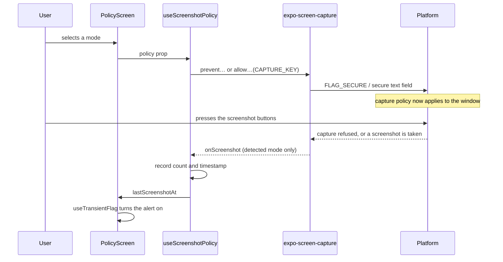

# Architecture

## The problem

A screenshot is taken by the operating system, outside the app. Everything an
app can do about it is a negotiation with the platform, and the platform offers
different terms on each side.

## What the library does underneath

`expo-screen-capture` presents one API over three quite different mechanisms.

### Android — one window flag

`preventScreenCaptureAsync()` sets `FLAG_SECURE` on the window. Android
documents the flag as treating the window's content as secure, keeping it out of
screenshots and off non-secure displays. The blank recents card is a consequence
of the same flag, not a separate feature.

There is no partial version: an app cannot blank its recents card while still
allowing screenshots.

### Android — detection, version dependent

From API 34 the platform reports captures directly, with no permission. Before
that, the callback is served from the media store, which requires
`READ_MEDIA_IMAGES` on Android 13 and `READ_EXTERNAL_STORAGE` before it.

### iOS — a text field, not a flag

`preventScreenCaptureAsync()` builds a `UITextField` with `isSecureTextEntry`
true and re-parents the key window's layer inside it, because the system
excludes that layer from captures:

```swift
// expo-screen-capture, iOS
let textField = UITextField()
textField.isSecureTextEntry = true
keyWindow.layer.superlayer?.addSublayer(textField.layer)
if let firstTextFieldSublayer = textField.layer.sublayers?.first {
  keyWindow.layer.removeFromSuperlayer()
  firstTextFieldSublayer.addSublayer(keyWindow.layer)
}
```

Screen recording cannot be refused at all, so the module stops trying: while
`UIScreen.main.isCaptured` is true it overlays a black view instead, hiding the
content rather than blocking the capture.

Detection on iOS is a notification — `userDidTakeScreenshotNotification` — and
always arrives after the fact.

## Data flow



## Why the state lives where it does

`useScreenshotPolicy` owns every interaction with the library:

- applies the selected policy to the platform
- restores capture on unmount, unconditionally
- resolves whether the capture API exists on this device
- requests the media permission where the platform requires it
- registers and removes the screenshot listener
- records the count and the timestamp of the last one

`PolicyScreen` holds one piece of state — the selected mode — and passes the
rest down. `ModeSelector`, `ModeStage`, and `DetectedAlert` take props and draw.
None of them imports the capture library, which is what makes the modes
auditable in a single file.

## Known limits

**Prevention is not a boundary.** Every mechanism here stops a software capture.
None of them stops a second phone pointed at the screen. The demo says so in the
README because a team that mistakes `FLAG_SECURE` for a security control will
make worse decisions than one that does not.

**iOS prevention is unsupported behaviour.** The secure text field trick is not
a documented API, and Apple's own wording is "in some cases". Treat support as
something to re-verify per iOS release.

**Detection is asymmetric.** On iOS it always works and never prevents. On
Android 13 and below it needs a permission an app may not be able to justify to
the Play Store, since Google restricts `READ_MEDIA_IMAGES` to apps with broad
photo access.
